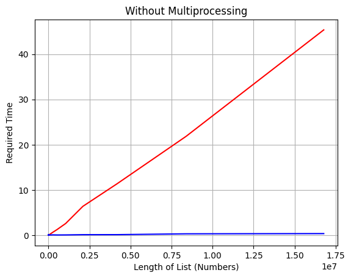

# Comparison-of-the-Speed-of-Multiprocessing-in-Python
This study compares Python's multiprocessing speed by evaluating execution times across various processors. It analyzes performance differences, highlighting optimal scenarios for multiprocessing utilization and aiding in efficient parallel processing decision-making.

  

